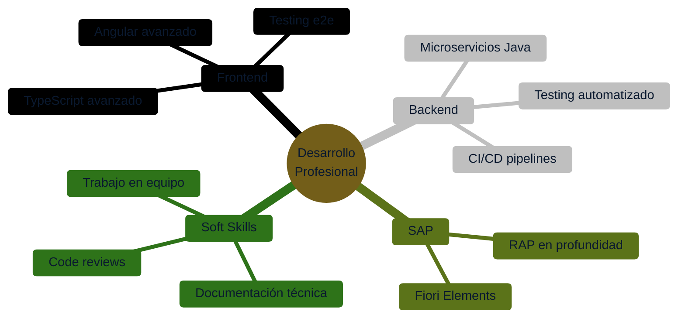

<div align="center">
  
</div>

<div align="center">

  [;Construyendo+APIs+REST+robustas+y+testeadas;Buscando+mi+pr%C3%B3xima+posici%C3%B3n+como+desarrollador+junior%2Fmid)](https://git.io/typing-svg)

</div>

<div align="center">

  [](https://github.com/Nicolas-Silva-Cremona)
  [](https://www.linkedin.com/in/nicolas-silva-cremona-567912311)
  [](mailto:nsilvacremona@gmail.com)
  [](https://github.com/Nicolas-Silva-Cremona)

</div>

---

## 👨‍💻 Sobre mí

> *"El código es poesía, pero solo si alguien más puede leerlo"*

Soy **Nicolás Silva Cremona**, desarrollador **full-stack** enfocado en **Angular** para frontend y **Java (Spring Boot)** para backend — la combinación a la que aplico activamente — con experiencia práctica también en **React**, **Python** y **PHP**. Actualmente ampliando mi perfil con formación en **SAP ABAP Cloud** (CDS Views y el modelo RAP), una perspectiva poco habitual en un perfil junior: entender tanto el desarrollo web moderno como el mundo de sistemas de gestión empresarial SAP.

- 🎯 **Especialización:** Full-Stack (Angular/React + Java/Spring Boot, APIs REST, autenticación, arquitectura en capas)
- 🔧 **Stack principal:** Angular, TypeScript, Java, Spring Boot
- 🧩 **También trabajo con:** React, Python (FastAPI), PHP
- 🌱 **Formándome en:** SAP ABAP Cloud (CDS Views, RAP), Docker, CI/CD
- 💡 **Filosofía:** Código limpio > código complejo — si no tiene tests, no está terminado
- 🏋️ **Fuera del código:** Deporte y nutrición para mantener el foco

---

## 🛠️ Stack Tecnológico

<div align="center">
  
</div>

<details>
  <summary><b>📦 Más detalles de mi stack</b></summary>

  **Frontend:** Angular (standalone components, RxJS), React (hooks), TypeScript, HTML5, CSS3
  **Backend:** Java 17 + Spring Boot, Python + FastAPI, PHP (clásico y con framework)
  **Bases de datos:** PostgreSQL, MySQL, SQLite
  **Herramientas:** Git, Docker, Swagger/OpenAPI, JUnit, pytest
  **SAP:** ABAP Cloud, CDS Views, RAP (Restful ABAP Programming Model)

</details>

---

## 🚀 Proyectos Destacados

<table>
<tr>
<td width="50%">

### 🅰️ Gestor de Inventario — Angular
Dashboard de gestión de inventario y pedidos
- **Stack:** Angular 18 standalone, RxJS, Material
- **Features:** JWT + guards/interceptors, formularios reactivos, dashboard con gráficas
- **Verificado:** build de producción sin errores

[](https://github.com/Nicolas-Silva-Cremona/gestor-inventario-angular)

</td>
<td width="50%">

### ☕ Gestor de Inventario — API
API REST en Spring Boot para el mismo dominio
- **Stack:** Java 17, Spring Boot 3, JPA, PostgreSQL
- **Features:** JWT, capas separadas, Swagger, Docker
- **Verificado:** 10/10 tests (JUnit + Mockito) en verde

[](https://github.com/Nicolas-Silva-Cremona/gestor-inventario-api-java)

</td>
</tr>

<tr>
<td width="50%">

### ⚛️ Rastreador de Gastos — React
SPA de seguimiento y categorización de gastos
- **Stack:** React 18, TypeScript, Vite
- **Features:** import CSV, gráficas de gasto, categorización asistida
- **Verificado:** build de producción sin errores

[](https://github.com/Nicolas-Silva-Cremona/rastreador-gastos-react)

</td>
<td width="50%">

### 🐍 Rastreador de Gastos — API
API con categorización automática por reglas
- **Stack:** FastAPI, SQLAlchemy 2.0, pandas, Alembic
- **Features:** JWT, import CSV, categorización, estadísticas
- **Verificado:** 24/24 tests (pytest) en verde

[](https://github.com/Nicolas-Silva-Cremona/rastreador-gastos-api-python)

</td>
</tr>

<tr>
<td width="50%">

### 🐘 Gestor de Biblioteca — PHP
Gestión de biblioteca en PHP clásico, sin framework
- **Stack:** PHP 8, PDO, MySQL
- **Features:** MVC ligero manual, préstamos/devoluciones
- **Verificado:** prepared statements en el 100% de las queries

[](https://github.com/Nicolas-Silva-Cremona/gestor-biblioteca-php)

</td>
<td width="50%">

### 🧩 SAP RAP — Gestión de Productos
Managed Business Object en SAP ABAP Cloud
- **Stack:** CDS Views, Behavior Definitions, RAP
- **Features:** validaciones, determinaciones, OData Service
- **Nota:** proyecto de aprendizaje, documentado paso a paso

[](https://github.com/Nicolas-Silva-Cremona/sap-rap-gestion-productos-abap)

</td>
</tr>
</table>

<div align="center">

### 🔒 HostMind — PMS SaaS (showcase)

PMS SaaS real en producción para gestión de alquiler vacacional (1-200 propiedades). Next.js, TypeScript, Tailwind, Prisma, PostgreSQL, asistente de WhatsApp con IA. Proyecto propietario — el repo documenta el producto sin exponer código fuente.

[](https://github.com/Nicolas-Silva-Cremona/hostmind-showcase)

</div>

---

## 📈 Estadísticas de GitHub

<div align="center">


</div>

---

## 🎯 Objetivos



---

## 💼 Principios de Desarrollo

```typescript
const myPrinciples = {
  code: {
    philosophy: "Clean Code > Clever Code",
    priority: "Legibilidad y mantenibilidad",
    testing: "Si no tiene tests, no está terminado"
  },
  workflow: {
    versionControl: "Git Flow",
    commits: "Convencionales y descriptivos",
    documentation: "El código se lee más de lo que se escribe"
  },
  learning: {
    approach: "Learning by doing",
    feedback: "Iteración rápida y mejora continua",
    collaboration: "El mejor código se escribe en equipo"
  }
};
```

---

## 🌟 En qué estoy trabajando ahora

- 🔨 **Portfolio activo:** 6 proyectos fullstack (Angular+Java, React+Python, PHP) con tests verificados
- 📚 **Estudiando:** SAP ABAP Cloud — CDS Views y el modelo RAP
- 🎓 **Consolidando:** arquitectura en capas, testing automatizado, Docker
- 💡 **Buscando:** mi próxima posición como desarrollador fullstack junior/mid

---

## 🤝 Colaboración

¿Tienes un proyecto interesante o una vacante donde pueda encajar? ¡Me encantaría saber de ti!

- 💼 Abierto a oportunidades como desarrollador fullstack junior/mid
- 🌱 Siempre dispuesto a aprender y compartir conocimiento
- 🔍 Interesado en contribuir a proyectos open source

---

## 📫 Contacto

<div align="center">

[](mailto:nsilvacremona@gmail.com)
[](https://www.linkedin.com/in/nicolas-silva-cremona-567912311)
[](https://github.com/Nicolas-Silva-Cremona)

**Respondo en menos de 24h** ⚡

</div>

---

## 💡 Quote del día

<div align="center">


</div>

---

<div align="center">
  

  ### ⭐ Si te gusta mi trabajo, no dudes en dar una estrella a mis repositorios
</div>
