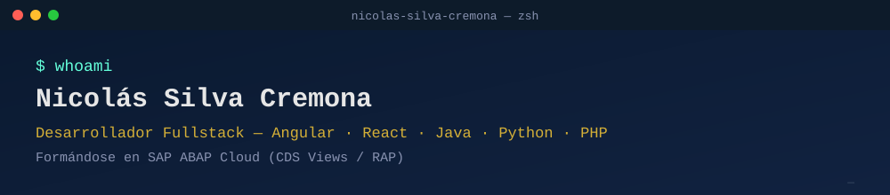

<div align="center">



<br/>


[](https://www.linkedin.com/in/nicolas-silva-cremona-567912311)
[](mailto:nsilvacremona@gmail.com)

</div>

## $ whoami

Desarrollador **fullstack** enfocado en **Angular** para frontend y **Java (Spring Boot)** para backend — la combinación que más me interesa y a la que aplico activamente — con experiencia práctica también en **React**, **Python** y **PHP**. Actualmente ampliando mi perfil con formación en **SAP ABAP Cloud** (CDS Views y el modelo RAP), lo que me da una perspectiva poco habitual en un perfil junior: entender tanto el desarrollo web moderno como el mundo de sistemas de gestión empresarial SAP.

Cada proyecto de este perfil está construido desde cero, con arquitectura en capas, tests y un README que explica no solo cómo instalarlo, sino **por qué** está construido así.

```text
$ cat perfil.json
{
  "buscando": "puesto de desarrollador fullstack junior/mid",
  "stack_principal": ["Angular", "TypeScript", "Java", "Spring Boot"],
  "tambien": ["React", "Python", "FastAPI", "PHP"],
  "formacion_actual": "SAP ABAP Cloud (CDS Views / RAP)",
  "ubicacion": "España",
  "modalidad": ["presencial", "híbrido", "remoto"]
}
```

## $ cat stack.txt

**Frontend**


**Backend**


**Datos e infraestructura**


**Formación actual**


## $ ls proyectos/

| Proyecto | Stack | Qué demuestra |
|---|---|---|
| [`gestor-inventario-angular`](https://github.com/Nicolas-Silva-Cremona/gestor-inventario-angular) | Angular · TypeScript · RxJS | Standalone components, formularios reactivos, guards/interceptors JWT, arquitectura modular |
| [`gestor-inventario-api-java`](https://github.com/Nicolas-Silva-Cremona/gestor-inventario-api-java) | Spring Boot · PostgreSQL | API REST en capas, JPA, seguridad JWT, tests JUnit/Mockito, Docker |
| [`rastreador-gastos-react`](https://github.com/Nicolas-Silva-Cremona/rastreador-gastos-react) | React · TypeScript | Consumo de API real, hooks, gestión de estado, gráficas |
| [`rastreador-gastos-api-python`](https://github.com/Nicolas-Silva-Cremona/rastreador-gastos-api-python) | FastAPI · PostgreSQL · pandas | API con categorización automática, import CSV, tests pytest |
| [`gestor-biblioteca-php`](https://github.com/Nicolas-Silva-Cremona/gestor-biblioteca-php) | PHP (sin framework) · MySQL | PDO con prepared statements, MVC ligero, seguridad (SQLi/XSS/CSRF) |
| [`sap-rap-gestion-productos-abap`](https://github.com/Nicolas-Silva-Cremona/sap-rap-gestion-productos-abap) | SAP ABAP Cloud · CDS · RAP | Managed Business Object completo: CDS views, behavior definition, validaciones |
| [`hostmind-showcase`](https://github.com/Nicolas-Silva-Cremona/hostmind-showcase) | Next.js · TypeScript · IA (showcase) | PMS SaaS real en producción para gestión de alquiler vacacional |

## $ stats --github

<div align="center">


<sub>Si las dos tarjetas de arriba no cargan: es el servicio gratuito <code>github-readme-stats.vercel.app</code>, que tiene caídas frecuentes por ser compartido por millones de perfiles — no es un enlace roto permanente, suele recuperarse solo en minutos/horas.</sub>

</div>

## $ contact --info

- **GitHub:** [@Nicolas-Silva-Cremona](https://github.com/Nicolas-Silva-Cremona)
- **Email:** [nsilvacremona@gmail.com](mailto:nsilvacremona@gmail.com)
- **LinkedIn:** [nicolas-silva-cremona](https://www.linkedin.com/in/nicolas-silva-cremona-567912311)

